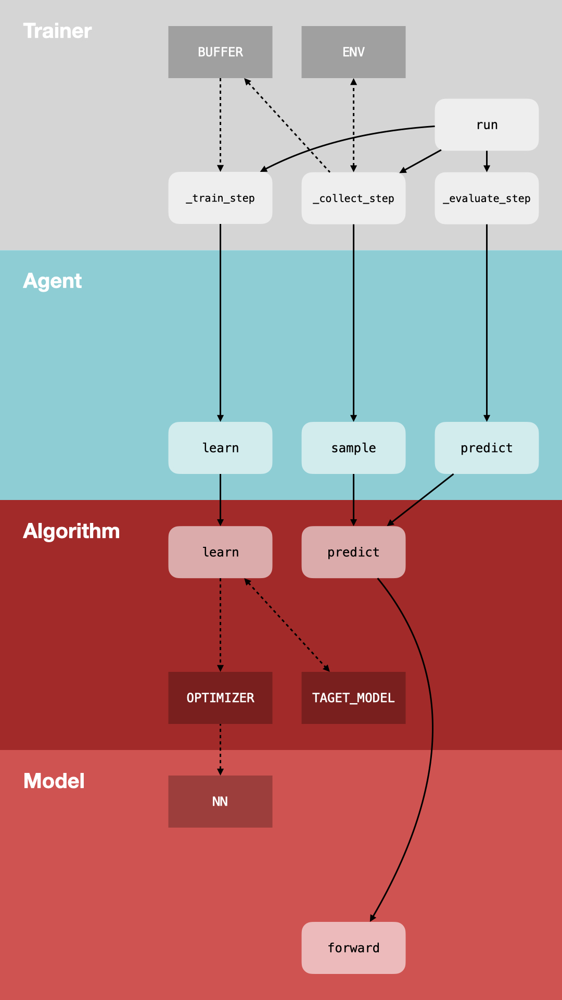

# RL_LAB 👨‍🔬

**单文件代码库、模块间低耦合，使改进代码时只专注于少量模块。**

## 背景

强化学习领域有许多高质量的代码库（[PARL](https://github.com/PaddlePaddle/PARL/), [stable-baselines3](https://github.com/DLR-RM/stable-baselines3), ...），但它们大多为了高代码复用率和可扩展性，采用多文件、多层抽象、模块化的设计。这样的设计不利于研究者快速了解算法实现细节，且在进行改进时需要仔细阅读文档，去了解大量的接口信息。

[cleanrl](https://github.com/vwxyzjn/cleanrl/) 是一个单文件的强化学习代码库，提供了清晰极简的算法实现。但其代码采用基于过程的实现方式，使得改进代码时，无法快速定位和限制需要改进的代码范围。

---

rl_lab 提供“有但不多”的模块化设计，和清晰的单文件算法实现。我们希望在上述两种类型的代码库之间，做出更适合强化学习算法研究者的平衡。*阅读代码时，在单文件代码中，快速了解算法的完整实现细节；改进算法时，得益于轻量的模块化设计，只需专注于少量的模块。*

## 模块设计

具体模块设计见 ➡️ [`base.py`](base.py)



## 参考

[OpenAI-SpinningUp: Algorithms](https://spinningup.openai.com/en/latest/algorithms/)

### 论文

- DQN
  - Mnih, Volodymyr, Koray Kavukcuoglu, David Silver, Andrei A. Rusu, Joel Veness, Marc G. Bellemare, Alex Graves, et al. “Human-Level Control through Deep Reinforcement Learning.” Nature 518, no. 7540 (February 26, 2015): 529–33. https://doi.org/10.1038/nature14236.
- DDPG
  - Lillicrap, Timothy P., Jonathan J. Hunt, Alexander Pritzel, Nicolas Heess, Tom Erez, Yuval Tassa, David Silver, and Daan Wierstra. “Continuous Control with Deep Reinforcement Learning.” arXiv, July 5, 2019. http://arxiv.org/abs/1509.02971.
- TD3
  - Fujimoto, Scott, Herke van Hoof, and David Meger. “Addressing Function Approximation Error in Actor-Critic Methods.” arXiv, October 22, 2018. http://arxiv.org/abs/1802.09477.
  - code: [sfujim/TD3](https://github.com/sfujim/TD3)
- SAC
  - Haarnoja, Tuomas, Haoran Tang, Pieter Abbeel, and Sergey Levine. “Reinforcement Learning with Deep Energy-Based Policies.” arXiv, July 21, 2017. http://arxiv.org/abs/1702.08165.
  - Haarnoja, Tuomas, Aurick Zhou, Pieter Abbeel, and Sergey Levine. “Soft Actor-Critic: Off-Policy Maximum Entropy Deep Reinforcement Learning with a Stochastic Actor.” arXiv, August 8, 2018. http://arxiv.org/abs/1801.01290.
  - Haarnoja, Tuomas, Vitchyr Pong, Aurick Zhou, Murtaza Dalal, Pieter Abbeel, and Sergey Levine. “Composable Deep Reinforcement Learning for Robotic Manipulation.” arXiv, March 18, 2018. http://arxiv.org/abs/1803.06773.
  - Haarnoja, Tuomas, Aurick Zhou, Kristian Hartikainen, George Tucker, Sehoon Ha, Jie Tan, Vikash Kumar, et al. “Soft Actor-Critic Algorithms and Applications.” arXiv, January 29, 2019. http://arxiv.org/abs/1812.05905.
  - code: [haarnoja/sac](https://github.com/haarnoja/sac)
- PPO
  - Fujimoto, Scott, Herke van Hoof, and David Meger. “Addressing Function Approximation Error in Actor-Critic Methods.” arXiv, October 22, 2018. http://arxiv.org/abs/1802.09477.
  - Schulman, John, Filip Wolski, Prafulla Dhariwal, Alec Radford, and Oleg Klimov. “Proximal Policy Optimization Algorithms.” arXiv, August 28, 2017. http://arxiv.org/abs/1707.06347.
  - Engstrom, Logan, Andrew Ilyas, Shibani Santurkar, Dimitris Tsipras, Firdaus Janoos, Larry Rudolph, and Aleksander Madry. “Implementation Matters in Deep Policy Gradients: A Case Study on PPO and TRPO.” arXiv, May 25, 2020. http://arxiv.org/abs/2005.12729.
  - Andrychowicz, Marcin, Anton Raichuk, Piotr Stańczyk, Manu Orsini, Sertan Girgin, Raphael Marinier, Léonard Hussenot, et al. “What Matters In On-Policy Reinforcement Learning? A Large-Scale Empirical Study.” arXiv, June 10, 2020. http://arxiv.org/abs/2006.05990.
  - [ICLR22 Blog: The 37 Implementation Details of Proximal Policy Optimization](https://iclr-blog-track.github.io/2022/03/25/ppo-implementation-details/)

### 代码库

- [cleanrl](https://github.com/vwxyzjn/cleanrl/) 🌟
- [PARL](https://github.com/PaddlePaddle/PARL/) 🌟
- [stable-baselines3](https://github.com/DLR-RM/stable-baselines3)
- [tianshou](https://github.com/thu-ml/tianshou)
- [ray](https://github.com/ray-project/ray/)

## 需求

### 主线

- DQN ✅
- DDPG ✅
- TD3 ✅
- SAC ✅
- PPO

### 支线

- DDQN ✅
- PDQN ✅
- Dueling DQN
- Noisy DQN
- Rainbow DQN
- Weighted Double DQN
- Averaged DQN
- A2C & A3C

## 代码风格

满足 PEP8 & PEP526

```shell
black -l 120 file_name
isort file_name
```
